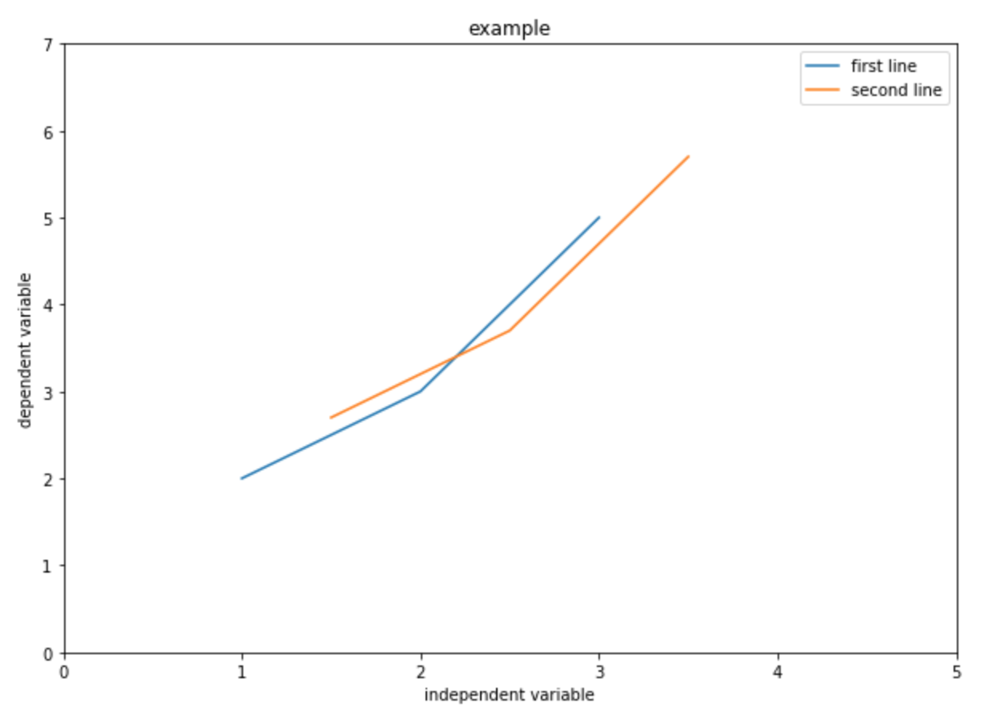
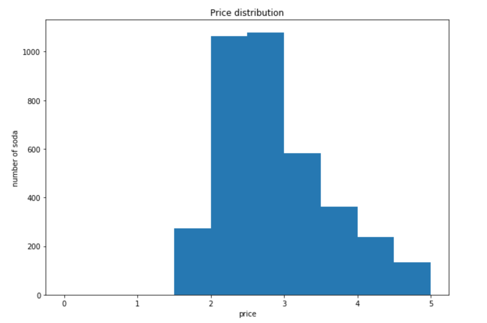
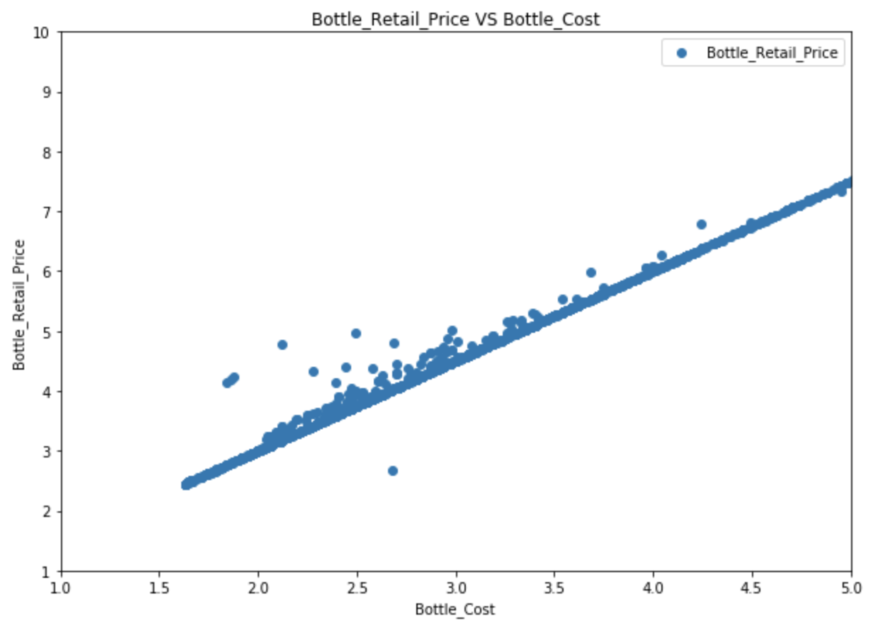

## Statistical Analysis with Scipy
Similar as the Dada Analytics Tools in Excel, python can perform many statistic analysis as well. [`scipy`](https://www.scipy.org/) module has many useful statistic tools. (more than Excel). 

### Linear Regression  
Let's start with linear regression. [scipy.stats.linregress](https://docs.scipy.org/doc/scipy/reference/generated/scipy.stats.linregress.html) is a very handy tool for linear regression.   
Let's try to perform a linear regression on the "Bottle_Retail_Price" and the "Bottle_Cost".  

```python  
# Get the two columns, note that you cannot have any NULL value in the input  
c_p = soda[["Bottle_Cost", "Bottle_Retail_Price"]].dropna()

# set dependent and independent variables  
x = c_p["Bottle_Cost"]
y = c_p["Bottle_Retail_Price"]

# perform linear regression
slope, intercept, r_value, p_value, std_err = stats.linregress(x, y)
```
That's it, you get the slope and intercept of your regression model. You can check the reliability of your regression model with r_value, p_value and std_err. 

### t-test
Let's try a different kind of statistical analysis. Assume you are interested in selling either energy drink or cola, and you want to know if the two categories has significant difference in average bottle sales. 
Since we only have data from two cities, we can perform a [t-test](https://docs.scipy.org/doc/scipy/reference/generated/scipy.stats.ttest_ind.html) assuming different variance. 
Firstly we need to use aggregate function to find the total bottle sold for each soda in each category. Remember the groupby function? Try to do it by yourself.  

```python
ct = inv_soda.groupby(['Item_Description','Category'])["Bottles_Sold"].agg(["sum"]).reset_index()
```

Then, you get the total bottles sold for the two categories. 
```
ct_eng = ct[ct["Category"] == "Energy Drink"]
ct_cola = ct[ct["Category"] == "Cola"]
```
Finally, you perform the t-test. 
```
stats.ttest_ind(ct_eng['sum'],ct_cola['sum'], equal_var=False)
```
Then you get 
```
Ttest_indResult(statistic=1.9035249229837687, pvalue=0.057480903679786859)
```
{: .output}
Well, the p value is not low enough to reject the null.  <br>

#### Takeaways
Scipy has a lot of statistical tools. You can perform anything in the Excel Data Analytics Tool with Scipy, yet it is much more powerful. For example, you can do [chi-squares](https://docs.scipy.org/doc/scipy/reference/generated/scipy.stats.chisquare.html#scipy.stats.chisquare), [ANOVA](https://docs.scipy.org/doc/scipy/reference/generated/scipy.stats.f_oneway.html#scipy.stats.f_oneway), [k-stat](https://docs.scipy.org/doc/scipy/reference/generated/scipy.stats.kstat.html#scipy.stats.kstat), etc. You can click the link to see all tools in [Scipy.stats](https://docs.scipy.org/doc/scipy/reference/stats.html). As you can observe above, the most difficult part is to preprocess the data. As soon as the data is prepaired, you can just feed it into the model, very easy.  

## Visualization  

### Basics   
Many of you are experts in Excel graphing. You can do similar visualization with python. [`matplotlib`](https://matplotlib.org/) is great module for visualization in python. Firsly, let's import the module.  

```python
# In majority of cases, you will just use pyplot. So you can just import that.   
import matplolib.pyplot as plt
```
Similar as Excel, you just need to feed in the values in x-axis and y-axis. Let's start with a very basic example:   
```python
# create three points for the first line
x = [1,2,3]
y = [2,3,5]
# create three points for the second line (optional, I just want to show you that you can plot multiple lines in one graph)
x2 = [1.5,2.5,3.5]
y2 = [2.7,3.7,5.7]
# change size (set size before plotting)
plt.figure(figsize=(10,7))
# plot the graph  
plt.plot(x,y, label = "first line")
plt.plot(x2,y2, label = "second line")
# Set x, y limits  
plt.xlim(0, 5)
plt.ylim(0, 7)
# Add x, y label  
plt.xlabel("independent variable")
plt.ylabel("dependent variable")
# Add title
plt.title("example") 
# Add legend  
plt.legend()
# show the graph
plt.show()
```
You will get something like this:  
{:height="400px"}

Without a graphic interface like Excel, it is a little less intuitive. Carefully review the code, and try to understand what each line is doing.  Note that [`pyplot.plot`](https://matplotlib.org/api/_as_gen/matplotlib.pyplot.plot.html) has a lot of parameters. Basically, you can customize everything such as color, marker, alpha, etc., you can click to read the documentation. 

### Histogram  
Let's go back to our data.  
Assume you want to see the price distribution of the soda that cost less than $5, you can draw a histogram with [`pyplot.hist`](https://matplotlib.org/api/_as_gen/matplotlib.pyplot.hist.html).  

```python
# set size
plt.figure(figsize=(10,7))
# feed in the data, set range, plot the graph 
plt.hist(soda['Bottle_Cost'], range=(0,5))
# set x, y label
plt.xlabel("price")
plt.ylabel("number of soda")
# Add title
plt.title("Price distribution") 
plt.show()
```
{:height="400px"}

This is a very basic example. You can customize a lot more parameters such as colors, bins, etc. 

### Scatter plot  
We have previously ran an regression on our data. Let's plot it! (Assume we are interested in the soda that cost less than $5) <br>
If you restarted your kernel and don't have slope, intercept variable, run the regression again  
 

```python
# set figure size  
plt.figure(figsize=(10,7))
# Plot the scatter 'o' means use circle marker  
plt.plot(x, y, 'o', label='Data')
# Plot the line  
plt.plot(x, intercept + slope*x, 'r', label='fitted line')
# Set x, y label  
plt.xlabel("Bottle_Cost")
plt.ylabel("Bottle_Retail_Price")
# Set title  
plt.title("Bottle_Retail_Price VS Bottle_Cost") 
# Set x, y limit  
plt.xlim(1, 5)
plt.ylim(1, 10)
plt.legend()
plt.show()
```
{:height="400px"}

#### Takeaways  
You can do many other kinds of visualization with matplotlib. For example, [pie chart](https://matplotlib.org/api/_as_gen/matplotlib.pyplot.pie.html), [bar chart](https://matplotlib.org/api/_as_gen/matplotlib.pyplot.bar.html), etc. Anything you can draw in Excel, you can do it with matplotlib. Similar as statistical analysis, the most difficult part for visualization is preprocessing. After that, you can just feed your data into the pre-written graphing tool.  
If you are going to big companies, you will probablly learn Tableau later. Tableau can easily create nice graphs but it is a little annoying in preprocessing. We can preprocess with python and feed the data to Tableau. <br> 
Last but not the least, there are many other cool visualization modules avaliable. If you have time, you can consider these modules: [plotly](https://plot.ly/), [graph-tool](https://graph-tool.skewed.de). They can draw cool and interactive graphs. 

